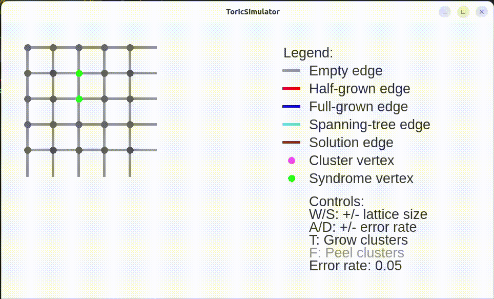

# ToricUnionFind

Union find decoder for toric code, visualised in PyQt. The toric code is a quantum error-correction
code, where the edges of a self-looping grid are the qubits, and the vertices are the generators.
A vertex will detect an error if there are an odd number of errors around.

This visualiser shows how, when given a list of syndrome vertices, the union find decoder can group
them into even clusters, then match them to correct the error.

Union find step based on this paper: https://arxiv.org/abs/1709.06218

Peeling decoder step based on this paper: https://journals.aps.org/prresearch/abstract/10.1103/PhysRevResearch.2.033042
